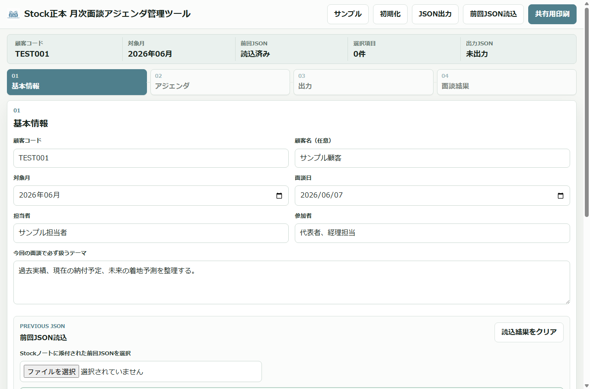
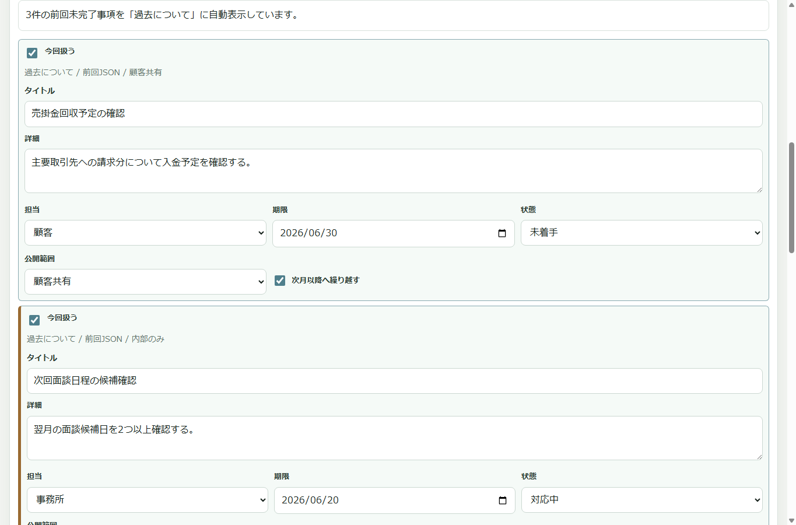
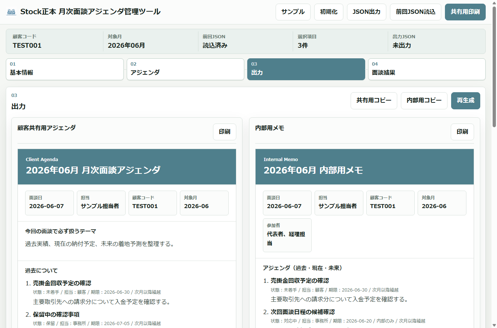
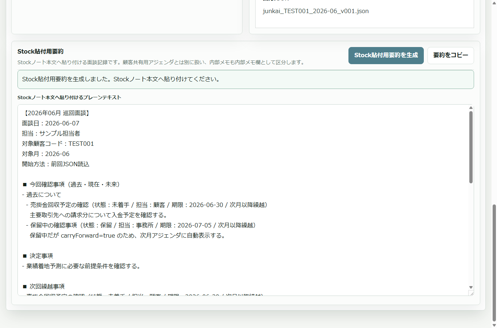
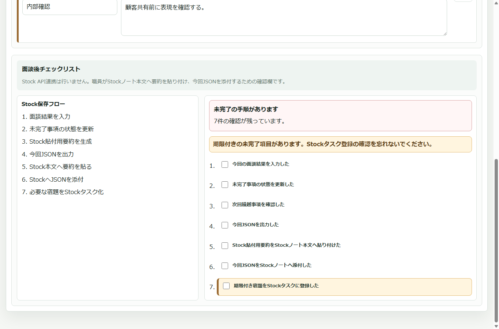

# Stock正本 月次面談アジェンダ管理ツール 操作マニュアル

このマニュアルは、職員が月次面談の前後でこのツールを使うための操作手順です。

このツールはStockの代替ではありません。正本は、Stockノート本文に貼り付ける人間が読める要約と、Stockノートに添付する今回JSONです。Stock API連携、自動ログイン、Stock画面の自動操作は行いません。

## 1. このツールでできること

- 前回Stockノートに添付されたJSONを読み込む
- 前回の未完了事項を今回アジェンダへ自動繰越する
- 過去について・現在について・未来についての3軸で、確認事項、宿題、状態、期限、公開範囲を整理する
- 顧客共有用アジェンダを作成し、コピーまたは印刷する
- 内部用メモを作成し、コピーまたは印刷する
- Stockノート本文へ貼り付ける要約文を生成する
- 今回分のJSONを出力し、Stockノートへ添付できるようにする
- 面談後チェックリストでStockへの保存漏れを防ぐ

## 2. 利用前の確認

1. `index.html` をブラウザで開きます。
2. Stockで対象顧客の前回月次面談ノートを開きます。
3. 前回ノートに添付されたJSONを職員PCへ一時的にダウンロードします。
4. 今回の対象月を確認します。形式は `YYYY-MM` です。

注意:

- JSONを職員PCだけに保存したままにしないでください。
- 顧客データや面談記録をGitHubリポジトリへ置かないでください。
- `visibility=internal` の項目や内部メモを顧客共有用として渡さないでください。

## 3. 画面の流れ

画面は次の4つのタブで進みます。

1. 基本情報
2. アジェンダ作成
3. 出力
4. 面談結果

通常は「基本情報」で前回JSONを読み込んでから、「アジェンダ作成」へ進みます。開始条件を満たさない場合、後続タブへは進めません。

### 画像で見る操作の流れ

以下の画像は、すべて架空のサンプルデータを使った画面例です。

1. 基本情報を入力し、前回JSONを読み込みます。



2. 前回JSONからの未完了事項が「過去について」に表示されます。



3. 顧客共有用アジェンダと内部用メモを分けて確認します。



4. Stockノート本文へ貼り付ける要約を生成します。



5. 面談後チェックリストで保存漏れを防ぎます。



## 4. 基本情報を入力する

「基本情報」タブで次を入力します。

- 顧客コード
- 顧客名。空欄でも運用できます
- 対象月
- 面談日
- 担当者
- 参加者
- 面談の目的

顧客コードと対象月は開始に必須です。対象月は `2026-06` のような年月形式で入力します。

## 5. 通常開始する

通常開始では、前回JSONの読込が必須です。


1. 「前回JSON読込」で前回ノートからダウンロードしたJSONを選択します。
2. 読込結果が表示されます。
3. 顧客コードが一致していることを確認します。
4. 前回JSONの対象月が今回対象月の前月であることを確認します。
5. 問題がなければ「前回JSONで開始」を押します。

ブロックされる例:

- 顧客コードが未入力
- 対象月が未入力または形式不正
- 前回JSONを読み込んでいない
- JSONの顧客コードが入力した顧客コードと一致しない
- JSON形式が壊れている
- 必須項目が不足している

前月以外のJSONを読み込んだ場合:

- 警告が表示されます。
- それでも開始する場合は、理由入力が必須です。
- 理由は今回JSONに記録されます。

## 6. 前回JSONなしで例外開始する

前回JSONが存在しない場合だけ、例外開始を使います。

1. 顧客コードと対象月を入力します。
2. 「前回JSONなしで開始」で例外理由を選びます。
3. 理由詳細を入力します。
4. 「前回JSONなしで開始」を押します。

例外理由:

- 初回作成
- 新規関与
- 前回面談なし
- データ移行前
- その他

「その他」を選んだ場合は、理由詳細の入力が必須です。例外開始の理由は今回JSONに残ります。

## 7. 過去についての繰越事項を確認する

前回JSONを読み込んで開始すると、次の条件を満たす項目が「過去について」に表示されます。


- `carryForward=true`
- 状態が `done` ではない
- 状態が `withdrawn` ではない

前回JSONからの繰越は、前回面談の話に限定するためではなく、過去から残っている論点として扱うために「過去について」に入ります。

表示される状態:

- 未着手
- 対応中
- 保留

表示されない状態:

- 完了
- 取り下げ
- 次月以降へ繰り越さない設定の項目

## 8. アジェンダ項目を編集する

「アジェンダ作成」タブでは、項目を「過去について・現在について・未来について」の3軸で整理します。

- 過去について: 過去実績、前回繰越、過去の決定事項や宿題の実施状況。
- 現在について: 現在の資金繰り、納付予定、中間納税の納付額・納付時期、現在の課題や相談事項。
- 未来について: 業績着地予測、短期経営計画、今後の打ち手、期限付き宿題。

項目ごとに次を編集できます。

- タイトル
- 詳細
- 担当
- 期限
- 状態
- 公開範囲
- 次月以降へ繰り越すかどうか

状態の意味:

- 未着手: まだ対応していない
- 対応中: 着手済みだが未完了
- 完了: 今回で完了。次月以降へ自動繰越しない
- 保留: 未完了だが保留。次月以降の繰越対象にできる
- 取り下げ: 対応不要。次月以降へ自動繰越しない

「完了」または「取り下げ」にした項目は、JSONには残りますが、次回読込時には自動繰越されません。

## 9. 新規事項を追加する

今回新たに発生した事項は「新規事項追加」から追加します。

入力できる内容:

- タイトル
- カテゴリ
- 詳細
- 担当
- 期限
- 状態
- 公開範囲
- 次月以降へ繰り越すかどうか

公開範囲は、顧客へ共有してよい内容なら `顧客共有`、顧客へ出さない内部確認事項なら `内部用` を選びます。

## 10. 顧客共有用と内部用を分ける

公開範囲の扱いは非常に重要です。

顧客共有用アジェンダ:

- `visibility=client` の項目だけを表示します。
- `visibility=internal` の項目は表示しません。
- 内部メモは表示しません。

内部用メモ:

- `visibility=client` と `visibility=internal` の両方を表示します。
- 内部メモも表示します。

Stock貼付用要約:

- Stock本文に残す面談記録です。
- 内部メモや内部向け項目は「内部メモ」セクションに区分して表示します。
- 顧客共有用アジェンダとは別物です。

## 11. 出力タブを使う

「出力」タブでは、次の出力を確認できます。


- 顧客共有用アジェンダ
- 内部用メモ
- Stock貼付用要約

顧客共有用アジェンダ:

1. 内容を確認します。
2. 必要に応じて「共有用コピー」を押します。
3. 印刷する場合は「印刷」を押します。

内部用メモ:

1. 内容を確認します。
2. 必要に応じて「内部用コピー」を押します。
3. 印刷する場合は「印刷」を押します。

出力内容を更新したい場合は「再生成」を押します。

## 12. Stock貼付用要約を生成する

面談後、Stockノート本文へ貼り付ける要約を作成します。


1. 面談結果タブで、決定事項、宿題、内部メモなどを入力します。
2. 出力タブで「Stock貼付用要約を生成」を押します。
3. テキストエリアに要約が表示されます。
4. 「要約をコピー」を押してコピーします。
5. コピーできない場合は、テキストエリアから手動でコピーします。
6. Stockノート本文へ貼り付けます。

要約に含まれる内容:

- 対象月
- 面談日
- 担当者
- 対象顧客コード
- 開始方法
- 今回確認事項（過去・現在・未来）
- 決定事項
- 次回繰越事項
- 顧客側の宿題
- 事務所側の宿題
- 内部メモ
- 添付JSONファイル名

## 13. 面談結果を入力する

「面談結果」タブで次を入力します。

- 決定事項
- 顧客側の宿題
- 事務所側の宿題
- 内部メモ

期限付きの未完了項目がある場合は、Stockタスクへの手動登録が必要です。このツールはStockタスクを自動作成しません。

## 14. 今回JSONを出力する

面談後、今回JSONを出力します。

1. 顧客コードと対象月が入力されていることを確認します。
2. 状態、次回繰越、公開範囲が正しいことを確認します。
3. 「JSON出力」を押します。
4. 出力されたJSONをStockノートへ添付します。

ファイル名は次の形式です。

```text
junkai_{clientCode}_{targetMonth}_v001.json
```

例:

```text
junkai_TEST001_2026-06_v001.json
```

このJSONは、翌月の「前回JSON」として読み込むためのものです。

## 15. 面談後チェックリストを完了する

「面談結果」タブのチェックリストを使って、Stock保存漏れを防ぎます。


チェック項目:

1. 今回の面談結果を入力した
2. 未完了事項の状態を更新した
3. 次回繰越事項を確認した
4. 今回JSONを出力した
5. Stock貼付用要約をStockノート本文へ貼り付けた
6. 今回JSONをStockノートへ添付した
7. 期限付き宿題をStockタスクに登録した

すべてチェックされるまでは「未完了の手順があります」と表示されます。すべてチェックすると「Stock保存フロー完了」と表示されます。

期限付きの未完了項目がある場合は、「期限付き宿題をStockタスクに登録した」が強調されます。

## 16. 翌月の使い方

翌月は、前月の面談後にStockへ添付したJSONを「前回JSON」として読み込みます。

1. Stockで前回月次面談ノートを開きます。
2. 前回ノートに添付されたJSONをダウンロードします。
3. このツールで今回の顧客コードと対象月を入力します。
4. 前回JSONとして読み込みます。
5. 未完了で繰越対象の項目だけが今回アジェンダへ表示されます。

前月に「完了」または「取り下げ」にした項目は、翌月の自動繰越には表示されません。

## 17. サンプルデータで練習する

練習や確認には、`sample-data` フォルダの架空データを使えます。

- `sample_previous.json`: 通常読込と繰越確認用
- `sample_invalid_client_code.json`: 顧客コード不一致確認用
- `sample_old_month.json`: 前月以外JSONの警告確認用
- `sample_january_previous_month.json`: 1月またぎ確認用
- `sample_completed_items.json`: 完了、取り下げ、繰越なし、保留の確認用
- `sample_internal_visibility.json`: 顧客共有用と内部用の分離確認用
- `sample_malformed_items.json`: 不正な項目の検証確認用
- `sample_broken_json.json`: 壊れたJSONのエラー確認用

サンプルはすべて架空データです。実在顧客名、実在事務所名、内部資料由来の文言は使わないでください。

## 18. よくあるエラーと対応

顧客コードが一致しない:

- 入力した顧客コードとJSON内の `clientCode` が違います。
- 対象顧客のStockノートから正しいJSONをダウンロードしてください。

対象月が前月ではない:

- 今回対象月の前月ではないJSONを読み込んでいます。
- やむを得ず使用する場合は、理由を入力して開始します。

前回JSONなしで開始できない:

- 例外理由と理由詳細が必要です。
- 「その他」を選んだ場合も理由詳細を必ず入力します。

顧客共有用に内部項目が出ない:

- 正常です。
- 内部項目は内部用メモまたはStock貼付用要約の内部メモ欄で確認します。

コピーできない:

- ブラウザや環境によりクリップボードコピーが失敗する場合があります。
- 表示されているテキストエリアから手動コピーしてください。

## 19. 禁止事項

- Stock API連携を追加しない。
- Stockへ自動ログインしない。
- Stock画面をスクレイピングしない。
- 外部サーバーへ送信しない。
- バックエンドやクラウドDBを追加しない。
- localStorageを正本として扱わない。
- 顧客データをGitHubリポジトリへ保存しない。
- 実在顧客名、実在事務所名、内部資料をサンプルに使わない。
- PDF表示、CSV読込、異常値判定、税務判断自動化に見える機能を復活させない。
